# CloudBrain: Advanced AI Coding Platform

CloudBrain is a sovereign AI pair-programming ecosystem designed for high-autonomy task execution. It combines a powerful CLI agent, a resilient Cloudflare-backend, and an intuitive dashboard to provide a "Gold Standard" coding experience.

## 🏗 System Architecture

```mermaid
graph TB
    subgraph "💻 Client Side"
        CLI["Expert CLI<br/>(12 Personas + FSM)"]
        Web["Admin Dashboard<br/>(React/Vite)"]
    end
    subgraph "☁️ Cloud Infrastructure (Cloudflare)"
        Hono["Hono API Gateway"]
        D1["D1 Database<br/>(Session Persistence)"]
        DO["Durable Objects<br/>(Real-time State)"]
        Worker["Background Workers<br/>(Async Tasks)"]
    end
    CLI <--> Hono
    Web <--> Hono
    Hono <--> D1
    Hono <--> DO
    Hono <--> Worker
```



## 📂 Project Structure

- [**/coding-brain-cli**](file:///c:/Users/test/Desktop/cloudbrain-clouflare/coding-brain-cli): Node.js agent with 12 intelligence personas, sovereign FSM, and professional UX.
- [**/coding-brain-backend**](file:///c:/Users/test/Desktop/cloudbrain-clouflare/coding-brain-backend): Serverless API built on Cloudflare Workers, featuring robust session management and RBAC.
- [**/coding-brain-frontend**](file:///c:/Users/test/Desktop/cloudbrain-clouflare/coding-brain-frontend): Management dashboard for monitoring sessions and controlling AI behavior.

## 📖 Complete Documentation

Explore the detailed guides in the [docs/](file:///c:/Users/test/Desktop/cloudbrain-clouflare/docs/) directory:

1.  [**User Guide**](file:///c:/Users/test/Desktop/cloudbrain-clouflare/docs/USER_GUIDE.md): Installation, authentication, and CLI usage.
2.  [**Features & Capabilities**](file:///c:/Users/test/Desktop/cloudbrain-clouflare/docs/FEATURES_AND_CAPABILITIES.md): Deep dive into the 12 agent personas and Smart Todo system.
3.  [**API Documentation**](file:///c:/Users/test/Desktop/cloudbrain-clouflare/docs/API_DOCUMENTATION.md): Reference for the CloudBrain Backend API.

## 🚀 Quick Start (CLI)

1. **Authentication**:
   ```bash
   brain auth
   ```
2. **Standard Task**:
   ```bash
   brain "Refactor the login logic in index.ts"
   ```
3. **Smart Todo Mode**:
   ```bash
   brain --todo "Build a full-stack dashboard with Auth"
   ```

---
© 2026 CloudBrain Project by Vikas Swami.
